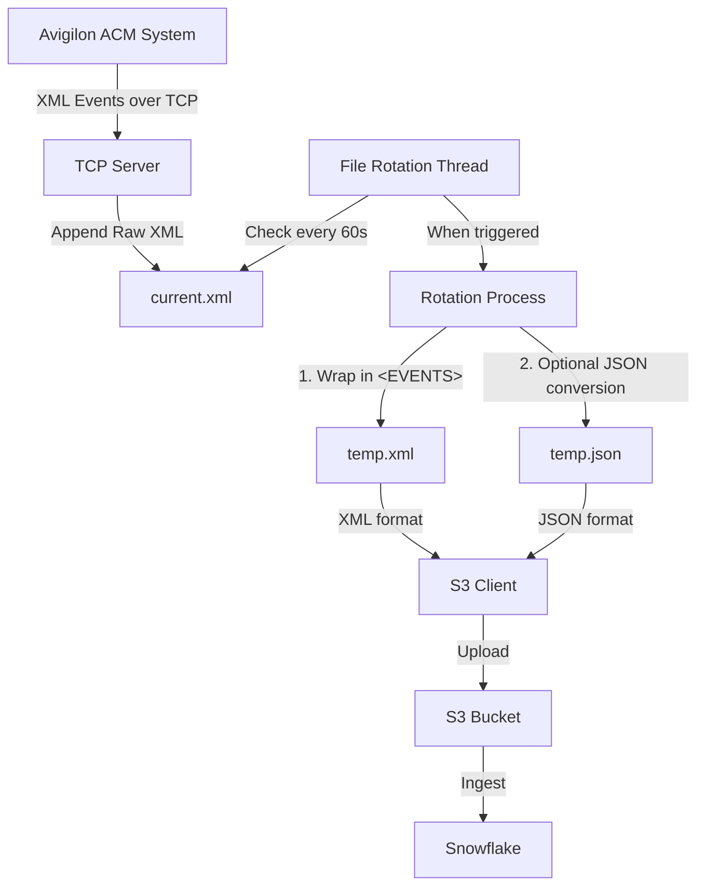

# Daikin XML Listener Middleware

A lightweight middleware for aggregating XML event streams from Avigilon ACM (Unity Access) systems into an S3 bucket, ensuring compatibility with Snowflake for data ingestion, processing, and reporting.

## Table of Contents

- [Overview](#overview)
- [Features](#features)
- [Architecture](#architecture)
- [Installation](#installation)
- [Configuration](#configuration)
- [Usage](#usage)
- [Snowflake Integration](#snowflake-integration)
- [Customization](#customization)
- [Troubleshooting](#troubleshooting)
- [Development](#development)

## Overview

This middleware acts as a bridge between Avigilon ACM systems and cloud data warehousing solutions. It listens for XML event streams from the ACM system, aggregates them into well-formed XML files, and uploads them to an S3 bucket for ingestion by Snowflake.

The middleware is designed to be:
- **Lightweight**: Minimal dependencies and resource usage
- **Reliable**: Robust error handling and recovery
- **Configurable**: Customizable through environment variables
- **Maintainable**: Clean, commented code for easy modification
- **Containerized**: Packaged as a Docker container for easy deployment

## Features

- **TCP Listener**: Accepts XML event streams from Avigilon ACM systems
- **File Rotation**: Rotates files hourly or at 10MB size limit
- **S3 Integration**: Uploads files to a specified S3 bucket and prefix
- **Snowflake Compatibility**: Ensures files are well-formed for Snowflake ingestion
- **JSON Support**: Optional conversion to JSON format for improved query performance
- **Threading**: Uses background threads for non-blocking operation
- **Error Handling**: Graceful recovery from connection drops, malformed XML, and upload failures
- **Logging**: Comprehensive logging for monitoring and troubleshooting

## Architecture

The middleware consists of several key components:

1. **TCP Server**: Listens for incoming XML events and writes them to a local file
2. **File Manager**: Handles file rotation based on time or size triggers
3. **S3 Client**: Manages uploads to the S3 bucket with retry logic
4. **Format Converter**: Optionally converts XML to JSON format



## Installation

### Prerequisites

- Docker
- AWS account with S3 bucket
- Avigilon ACM system configured for XML collaboration

### Quick Installation

#### Option 1: Using Docker Compose (Recommended)

The easiest way to get started is with Docker Compose:

```bash
git clone https://github.com/your-org/daikin-xml-listener.git
cd daikin-xml-listener

# Copy and edit the environment file
cp .env.example .env
# Edit .env with your S3 configuration

# Build and start the service
docker-compose up -d
```

See [QUICKSTART.md](QUICKSTART.md) for detailed docker-compose instructions.

#### Option 2: Using Docker Run

For a quick deployment with docker run:

```bash
git clone https://github.com/ddelorez/DTTP_XML_Middleware.git
cd DTTP_XML_Middleware
docker build -t xml-stream-aggregator .
docker run -d \
  -p 8080:8080 \
  -e BUCKET_NAME=your-bucket-name \
  -e AWS_ACCESS_KEY_ID=your-access-key \
  -e AWS_SECRET_ACCESS_KEY=your-secret-key \
  -e AWS_REGION=your-region \
  --name xml-listener \
  xml-stream-aggregator
```

### Secure Installation (Recommended)

For production deployments with enhanced security:

```bash
# Use the secure deployment script
chmod +x secure_deploy.sh
./secure_deploy.sh

# Start the service
./start_secure.sh

# Configure firewall for Avigilon ACM
./configure_firewall.sh
```

The secure deployment includes:
- Non-root container execution
- Connection and rate limiting
- Resource constraints
- Localhost-only binding
- Secure credential storage

### Manual Installation

1. Ensure Python 3.12 is installed
2. Clone this repository
3. Install dependencies:
   ```bash
   pip install -r requirements.txt
   ```
4. Run the server:
   ```bash
   python server.py
   ```

## Configuration

The middleware is configured through environment variables:

### Core Settings

| Variable | Description | Default | Required |
|----------|-------------|---------|----------|
| PORT | TCP port to listen on | 8080 | No |
| BUCKET_NAME | S3 bucket for uploads | - | Yes |
| PREFIX | S3 key prefix | xml-events/ | No |
| ROTATION_INTERVAL | File rotation interval in seconds | 3600 | No |
| MAX_FILE_SIZE | Max file size in bytes | 10485760 (10MB) | No |
| AWS_ACCESS_KEY_ID | AWS access key | - | Yes |
| AWS_SECRET_ACCESS_KEY | AWS secret key | - | Yes |
| AWS_REGION | AWS region | - | Yes |
| OUTPUT_FORMAT | Output format (xml or json) | xml | No |
| USE_DATE_FOLDERS | Organize files in date-based folders | false | No |
| PRETTY_PRINT_JSON | Format JSON with indentation | true | No |

### Security Settings

| Variable | Description | Default | Required |
|----------|-------------|---------|----------|
| BIND_HOST | Interface to bind to | 0.0.0.0 | No |
| MAX_CONNECTIONS | Maximum concurrent connections | 50 | No |
| MAX_MESSAGE_SIZE | Maximum message size in bytes | 1048576 (1MB) | No |
| RATE_LIMIT_ENABLED | Enable rate limiting | true | No |
| RATE_LIMIT_WINDOW | Rate limit window in seconds | 60 | No |
| RATE_LIMIT_MAX_EVENTS | Max events per window | 1000 | No |

## Usage

### Configuring Avigilon ACM

1. In the ACM system, navigate to Settings > External Systems > Collaboration
2. Create a new XML collaboration with the following settings:
   - Host: IP address of the middleware server
   - Port: Port the middleware is listening on (default: 8080)
   - Require TCP: Enabled
3. Select the events you want to stream
4. Save and activate the collaboration

Refer to the `Reference Docs/XML Events Collaboration.pdf` for detailed setup instructions and sample event data.

### Verifying Operation

1. Check the logs to ensure the server is running:
   ```bash
   docker logs xml-listener
   ```

2. Trigger an event in the ACM system (e.g., badge scan, door access)

3. Verify that files are being uploaded to your S3 bucket:
   ```bash
   aws s3 ls s3://your-bucket-name/xml-events/
   ```

## Snowflake Integration

### Setting up Snowflake for XML Data

1. Create an S3 stage:
   ```sql
   CREATE STAGE my_s3_stage
   URL = 's3://<BUCKET_NAME>/<PREFIX>'
   CREDENTIALS = (AWS_KEY_ID = '<key>' AWS_SECRET_KEY = '<secret>')
   FILE_FORMAT = (TYPE = XML);
   ```

2. Create a table for the events:
   ```sql
   CREATE TABLE xml_events (
     event_data VARIANT,
     load_timestamp TIMESTAMP_NTZ DEFAULT CURRENT_TIMESTAMP()
   );
   ```

3. Set up data ingestion:
   ```sql
   COPY INTO xml_events (event_data)
   FROM @my_s3_stage
   FILE_FORMAT = (TYPE = XML)
   ON_ERROR = 'CONTINUE';
   ```

4. Query the data:
   ```sql
   SELECT
     GET_PATH(PARSE_XML(event_data), 'EVENT/plasectrxEventname')::STRING AS event_name,
     GET_PATH(PARSE_XML(event_data), 'EVENT/plasectrxRecdate')::TIMESTAMP AS rec_date
   FROM xml_events
   WHERE event_name = 'Input point in alarm';
   ```

### Setting up Snowflake for JSON Data

If using the JSON output format:

1. Create an S3 stage with JSON format:
   ```sql
   CREATE STAGE my_json_stage
   URL = 's3://<BUCKET_NAME>/<PREFIX>'
   CREDENTIALS = (AWS_KEY_ID = '<key>' AWS_SECRET_KEY = '<secret>')
   FILE_FORMAT = (TYPE = JSON);
   ```

2. Create a table for the events:
   ```sql
   CREATE TABLE json_events (
     event_data VARIANT,
     load_timestamp TIMESTAMP_NTZ DEFAULT CURRENT_TIMESTAMP()
   );
   ```

3. Set up data ingestion:
   ```sql
   COPY INTO json_events (event_data)
   FROM @my_json_stage
   FILE_FORMAT = (TYPE = JSON)
   ON_ERROR = 'CONTINUE';
   ```

4. Query the data (more efficient than XML):
   ```sql
   SELECT
     event_data:plasectrxEventname::STRING AS event_name,
     event_data:plasectrxRecdate::TIMESTAMP AS rec_date
   FROM json_events
   WHERE event_name = 'Input point in alarm';
   ```

## Security Features

The middleware includes several security features:

### Network Security
- **Configurable bind host**: Restrict listening interface
- **Connection limiting**: Prevent resource exhaustion
- **Rate limiting**: Prevent abuse from single IPs
- **Message size limits**: Prevent DoS attacks

### Container Security
- **Non-root execution**: Runs as unprivileged user
- **Read-only filesystem**: With tmpfs for temporary data
- **Resource limits**: CPU and memory constraints
- **Security options**: No new privileges flag

### Data Security
- **HTTPS for S3**: All uploads use TLS 1.2+
- **No credential storage**: Uses environment variables
- **Secure credential handling**: Supports Docker secrets

### Deployment Security

For maximum security, deploy with:

```bash
# Use docker-compose with security settings
docker-compose up -d

# Or manually with security options
docker run -d \
  --name xml-listener \
  --user 1001:0 \
  --read-only \
  --tmpfs /app/data:mode=1777,size=100M \
  --security-opt no-new-privileges:true \
  --memory="512m" \
  --cpus="1.0" \
  -p 127.0.0.1:8080:8080 \
  -e BUCKET_NAME=$BUCKET_NAME \
  -e AWS_ACCESS_KEY_ID=$AWS_ACCESS_KEY_ID \
  -e AWS_SECRET_ACCESS_KEY=$AWS_SECRET_ACCESS_KEY \
  -e AWS_REGION=$AWS_REGION \
  -e MAX_CONNECTIONS=10 \
  -e RATE_LIMIT_ENABLED=true \
  xml-stream-aggregator
```

## Customization

The middleware is designed to be easily customizable. Here are some common modifications:

### Security Customization

Adjust security parameters based on your environment:

```bash
# Strict settings for internet-facing deployment
-e MAX_CONNECTIONS=5
-e RATE_LIMIT_MAX_EVENTS=100
-e MAX_MESSAGE_SIZE=524288  # 512KB

# Relaxed settings for trusted internal network
-e MAX_CONNECTIONS=100
-e RATE_LIMIT_ENABLED=false
-e MAX_MESSAGE_SIZE=10485760  # 10MB
```

### Network Configuration

For internal network deployment:

```bash
# Bind to specific internal interface
-e BIND_HOST=192.168.1.100

# Or use docker-compose with custom network
docker-compose -f docker-compose.yml up -d
```

### Monitoring Integration

The middleware provides detailed logs suitable for monitoring:

```bash
# View logs
docker logs -f xml-listener

# Export logs to monitoring system
docker logs xml-listener | grep "ERROR\|WARNING" | \
  your-log-shipper --destination monitoring-system
```

## Troubleshooting

### Connection Issues

If the middleware cannot receive events from the ACM system:

1. Verify the ACM collaboration settings (host, port)
2. Check network connectivity and firewall rules
3. Ensure the middleware is running and listening on the correct port

### S3 Upload Failures

If files are not being uploaded to S3:

1. Verify AWS credentials and permissions
2. Check the S3 bucket name and region
3. Look for detailed error messages in the logs

### XML Validation Errors

If XML validation is failing:

1. Check the ACM system's XML output format
2. Look for malformed XML in the logs
3. Consider disabling strict validation temporarily

## Development

### Project Structure

```
Daikin XML Listener/
├── src/                   # Source code
│   ├── server.py          # Main middleware script
│   ├── requirements.txt   # Python dependencies
│   ├── generate_test_events.py  # Test event generator
│   └── test_server.py     # Test server
├── docs/                  # Documentation
│   ├── design/            # Design documents
│   └── reference/         # Reference documentation
├── scripts/               # Utility scripts
├── docker/                # Docker configurations
├── Dockerfile             # Container definition
├── README.md              # This documentation
├── QUICKSTART.md          # Quick start guide
└── LICENSE                # License file
```

### Running Tests

```bash
# Run unit tests
python -m unittest discover tests

# Simulate an XML stream for testing
nc localhost 8080 < tests/sample_event.xml
```

### Contributing

1. Fork the repository
2. Create a feature branch
3. Make your changes
4. Submit a pull request

### Design Documents

For detailed design information, see the following documents:

- [TCP Server Design](docs/design/tcp_server_design.md)
- [File Management Design](docs/design/file_management_design.md)
- [S3 Upload Design](docs/design/s3_upload_design.md)
- [JSON Conversion Design](docs/design/json_conversion_design.md)
- [Dockerfile Design](docs/design/dockerfile_design.md)