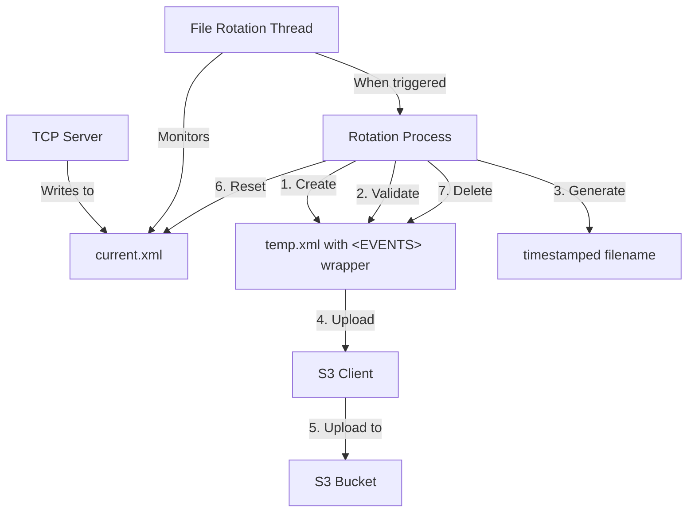

# File Management System Design

## Overview
The file management system is responsible for rotating the XML data files, ensuring they are properly formatted for Snowflake ingestion, and managing the local storage. It works in conjunction with the TCP server and S3 upload components to provide a complete data pipeline.

## Architecture Diagram



## Component Design

### 1. File Rotation Trigger
- **Time-based**: Rotate files every 60 seconds for real-time BI (configurable via `ROTATION_INTERVAL`, default: 60 seconds)
- **Size-based**: Rotate when file size exceeds 5MB (configurable via `MAX_FILE_SIZE`, default: 5MB)
- **Check Frequency**: Monitor file every 10 seconds for rotation conditions (more responsive)
- **Rotation Logic**: Files rotate on whichever condition is met first (time OR size)

### 2. Rotation Process
- **Thread Safety**: Coordinate with TCP server using file locks
- **XML Processing**:
  - Strip individual XML declarations from ACM events (ACM sends one per event)
  - Wrap raw XML content in `<EVENTS>` root element with single XML declaration
- **Validation**: Ensure well-formed XML using `xml.etree.ElementTree`
- **Format Conversion**: Optional conversion to JSON format for Snowflake optimization
- **Timestamping**: Generate filenames with UTC timestamps (e.g., `20250729_161500.json`)
- **Cleanup**: Reset `current.xml` and remove temporary files after successful upload

### 3. Error Handling
- **Validation Failures**: Fallback to raw content upload if XML validation fails
- **Retry Logic**: Implement exponential backoff for failed operations
- **Logging**: Comprehensive logging of rotation events and errors

### 4. Code Structure

```python
# Pseudocode for File Management System

import os
import time
import threading
import logging
import xml.etree.ElementTree as ET
from datetime import datetime
from typing import Dict, Any

class FileManager:
    def __init__(self, config: Dict[str, Any]):
        """Initialize file manager with configuration."""
        self.current_file = config.get("CURRENT_FILE", "./current.xml")
        self.temp_file = config.get("TEMP_FILE", "./temp.xml")
        self.rotation_interval = int(config.get("ROTATION_INTERVAL", 3600))  # 1 hour
        self.max_file_size = int(config.get("MAX_FILE_SIZE", 10 * 1024 * 1024))  # 10MB
        self.check_interval = 60  # Check every 60 seconds
        self.file_lock = threading.Lock()
        self.running = False
        self.rotation_thread = None
        self.s3_client = None  # Will be initialized with S3Client
        
    def start(self, file_lock, s3_client):
        """Start the file rotation thread."""
        self.file_lock = file_lock  # Share lock with TCP server
        self.s3_client = s3_client
        self.running = True
        
        # Initialize empty current file if it doesn't exist
        if not os.path.exists(self.current_file):
            with open(self.current_file, "w") as f:
                pass
        
        self.rotation_thread = threading.Thread(target=self.rotation_loop)
        self.rotation_thread.daemon = True
        self.rotation_thread.start()
        logging.info("File rotation thread started")
        
    def rotation_loop(self):
        """Main loop checking for rotation conditions."""
        last_rotation_time = time.time()
        
        while self.running:
            try:
                current_time = time.time()
                
                # Check if rotation is needed
                rotation_needed = False
                
                # Time-based rotation
                if current_time - last_rotation_time >= self.rotation_interval:
                    logging.info("Time-based rotation triggered")
                    rotation_needed = True
                
                # Size-based rotation
                if os.path.exists(self.current_file):
                    file_size = os.path.getsize(self.current_file)
                    if file_size >= self.max_file_size:
                        logging.info(f"Size-based rotation triggered: {file_size} bytes")
                        rotation_needed = True
                
                if rotation_needed:
                    self.rotate_file()
                    last_rotation_time = current_time
                
                # Sleep until next check
                time.sleep(self.check_interval)
                
            except Exception as e:
                logging.error(f"Error in rotation loop: {e}")
                time.sleep(self.check_interval)  # Continue despite errors
    
    def rotate_file(self):
        """Rotate the current file, wrap in EVENTS tags, and upload to S3."""
        timestamp = datetime.utcnow().strftime("%Y%m%d_%H%M%S")
        s3_key = f"{timestamp}.xml"
        
        try:
            # Acquire lock to prevent TCP server from writing during rotation
            with self.file_lock:
                # Skip if file is empty
                if os.path.getsize(self.current_file) == 0:
                    logging.info("Skipping rotation for empty file")
                    return
                
                # Read current file content
                with open(self.current_file, "r") as f:
                    content = f.read()
                
                # Wrap content in EVENTS tags
                wrapped_content = f"<EVENTS>\n{content}</EVENTS>"
                
                # Write to temp file
                with open(self.temp_file, "w") as f:
                    f.write(wrapped_content)
                
                # Validate XML
                try:
                    ET.parse(self.temp_file)
                    is_valid_xml = True
                except ET.ParseError as e:
                    logging.error(f"XML validation failed: {e}")
                    is_valid_xml = False
                
                # Upload to S3
                if is_valid_xml:
                    success = self.s3_client.upload_file(self.temp_file, s3_key)
                else:
                    # Fallback: upload raw content
                    logging.warning("Uploading raw content due to XML validation failure")
                    fallback_key = f"{timestamp}_raw.xml"
                    success = self.s3_client.upload_file(self.current_file, fallback_key)
                
                if success:
                    # Reset current file
                    with open(self.current_file, "w") as f:
                        pass
                    
                    # Delete temp file
                    if os.path.exists(self.temp_file):
                        os.remove(self.temp_file)
                    
                    logging.info(f"File rotated and uploaded successfully: {s3_key}")
                else:
                    logging.error("Failed to upload rotated file to S3")
                
        except Exception as e:
            logging.error(f"Error during file rotation: {e}")
    
    def stop(self):
        """Stop the file rotation thread."""
        self.running = False
        if self.rotation_thread:
            self.rotation_thread.join(timeout=5)
        logging.info("File rotation thread stopped")
```

### 5. Integration Points

- **TCP Server**: Shares file lock for thread-safe access to `current.xml`
- **S3 Client**: Uses S3 client for uploading rotated files
- **Configuration**: Reads settings from environment variables
- **Logging**: Comprehensive logging for monitoring and debugging

### 6. Error Handling and Resilience

- **XML Validation**: Fallback mechanism for malformed XML
- **File System Errors**: Retry logic for file operations
- **Thread Safety**: Proper locking to prevent file corruption
- **Continuous Operation**: Errors in one rotation cycle don't stop the thread

## Considerations and Trade-offs

1. **Memory Usage**: Reading entire file into memory could be problematic for very large files
2. **XML Validation**: Full validation adds overhead but ensures data quality
3. **Locking Strategy**: File lock during rotation may briefly block TCP server
4. **Error Recovery**: Fallback to raw upload ensures data is never lost, even if malformed