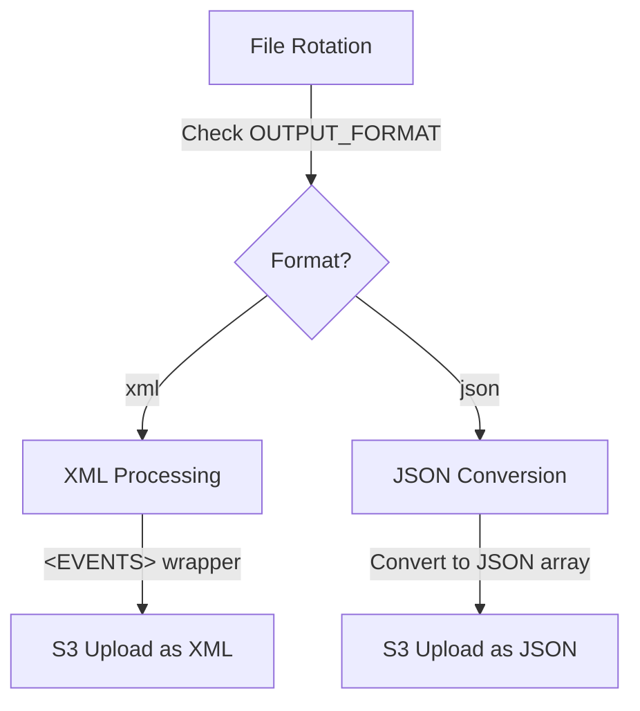

# JSON Conversion Feature Design

## Overview
The JSON conversion feature provides an optional output format that converts the XML event data to JSON before uploading to S3. This can improve query performance in Snowflake and provide more flexibility for downstream consumers of the data.

## Architecture Diagram



## Component Design

### 1. Configuration
- **Output Format**: Configurable via environment variable `OUTPUT_FORMAT` (default: `xml`, alternative: `json`)
- **Integration**: Seamlessly integrated with existing file rotation and S3 upload components

### 2. Conversion Process
- **XML Parsing**: Use `xml.etree.ElementTree` to parse the XML events
- **JSON Transformation**: Convert each `<EVENT>` element to a JSON object
- **Array Structure**: Wrap all events in a JSON array for consistent structure
- **Formatting**: Pretty-print JSON for readability (configurable)

### 3. Snowflake Compatibility
- **File Extension**: Use `.json` extension for JSON files
- **Content Type**: Set appropriate content type (`application/json`)
- **Structure**: Ensure JSON structure is compatible with Snowflake's JSON parsing

### 4. Code Structure

```python
# Pseudocode for JSON Conversion Feature

import json
import xml.etree.ElementTree as ET
import logging
from typing import Dict, Any, List, Optional

class FormatConverter:
    def __init__(self, config: Dict[str, Any]):
        """Initialize format converter with configuration."""
        self.output_format = config.get("OUTPUT_FORMAT", "xml").lower()
        self.pretty_print = config.get("PRETTY_PRINT_JSON", True)
        
    def is_json_output(self) -> bool:
        """Check if output format is JSON."""
        return self.output_format == "json"
    
    def get_file_extension(self) -> str:
        """Get the appropriate file extension based on output format."""
        return ".json" if self.is_json_output() else ".xml"
    
    def convert_to_json(self, xml_file_path: str, json_file_path: Optional[str] = None) -> Optional[str]:
        """
        Convert XML file to JSON format.
        
        Args:
            xml_file_path: Path to the XML file
            json_file_path: Optional output path, if None, replaces extension with .json
            
        Returns:
            str: Path to the JSON file if successful, None otherwise
        """
        if not json_file_path:
            json_file_path = xml_file_path.rsplit(".", 1)[0] + ".json"
        
        try:
            # Parse XML file
            tree = ET.parse(xml_file_path)
            root = tree.getroot()
            
            # Check if root is EVENTS
            if root.tag != "EVENTS":
                logging.warning(f"Root element is not EVENTS: {root.tag}")
                # Wrap in EVENTS if needed
                events_root = ET.Element("EVENTS")
                if root.tag == "EVENT":
                    events_root.append(root)
                else:
                    for event in root.findall(".//EVENT"):
                        events_root.append(event)
                root = events_root
            
            # Convert to list of dictionaries
            events_list = []
            for event in root.findall(".//EVENT"):
                event_dict = {}
                for child in event:
                    # Handle text content
                    if child.text is not None:
                        event_dict[child.tag] = child.text.strip()
                    else:
                        event_dict[child.tag] = ""
                events_list.append(event_dict)
            
            # Write JSON file
            with open(json_file_path, "w") as f:
                if self.pretty_print:
                    json.dump(events_list, f, indent=2)
                else:
                    json.dump(events_list, f)
            
            logging.info(f"Successfully converted {xml_file_path} to JSON: {json_file_path}")
            return json_file_path
            
        except ET.ParseError as e:
            logging.error(f"XML parsing error during conversion: {e}")
            return None
        except Exception as e:
            logging.error(f"Error converting XML to JSON: {e}")
            return None
    
    def process_file(self, input_file_path: str) -> Optional[str]:
        """
        Process file according to configured output format.
        
        Args:
            input_file_path: Path to the input file (XML)
            
        Returns:
            str: Path to the processed file (original or converted)
        """
        if self.is_json_output():
            return self.convert_to_json(input_file_path)
        else:
            return input_file_path
```

### 5. Integration with File Rotation

```python
# Pseudocode for integration with FileManager

def rotate_file(self):
    """Rotate the current file, process according to format, and upload to S3."""
    timestamp = datetime.utcnow().strftime("%Y%m%d_%H%M%S")
    
    try:
        # Acquire lock to prevent TCP server from writing during rotation
        with self.file_lock:
            # Skip if file is empty
            if os.path.getsize(self.current_file) == 0:
                logging.info("Skipping rotation for empty file")
                return
            
            # Read current file content
            with open(self.current_file, "r") as f:
                content = f.read()
            
            # Wrap content in EVENTS tags for XML
            wrapped_content = f"<EVENTS>\n{content}</EVENTS>"
            
            # Write to temp file
            with open(self.temp_file, "w") as f:
                f.write(wrapped_content)
            
            # Process according to output format
            if self.format_converter.is_json_output():
                # Convert to JSON
                processed_file = self.format_converter.convert_to_json(self.temp_file)
                if not processed_file:
                    logging.error("JSON conversion failed, falling back to XML")
                    processed_file = self.temp_file
                    file_extension = ".xml"
                else:
                    file_extension = ".json"
            else:
                # Use XML
                processed_file = self.temp_file
                file_extension = ".xml"
            
            # Generate S3 key with appropriate extension
            s3_key = f"{timestamp}{file_extension}"
            
            # Upload to S3
            success = self.s3_client.upload_file(processed_file, s3_key)
            
            if success:
                # Reset current file
                with open(self.current_file, "w") as f:
                    pass
                
                # Delete temp files
                if os.path.exists(self.temp_file):
                    os.remove(self.temp_file)
                if processed_file != self.temp_file and os.path.exists(processed_file):
                    os.remove(processed_file)
                
                logging.info(f"File rotated and uploaded successfully: {s3_key}")
            else:
                logging.error("Failed to upload rotated file to S3")
            
    except Exception as e:
        logging.error(f"Error during file rotation: {e}")
```

### 6. Snowflake Integration for JSON

```sql
-- Example Snowflake setup for JSON files
CREATE STAGE my_s3_stage
URL = 's3://<BUCKET_NAME>/<PREFIX>'
CREDENTIALS = (AWS_KEY_ID = '<key>' AWS_SECRET_KEY = '<secret>')
FILE_FORMAT = (TYPE = JSON);

-- Table schema remains the same
CREATE TABLE json_events (
  event_data VARIANT,
  load_timestamp TIMESTAMP_NTZ DEFAULT CURRENT_TIMESTAMP()
);

-- Ingestion
COPY INTO json_events (event_data)
FROM @my_s3_stage
FILE_FORMAT = (TYPE = JSON)
ON_ERROR = 'CONTINUE';

-- Sample query (more efficient than XML)
SELECT
  event_data:plasectrxEventname::STRING AS event_name,
  event_data:plasectrxRecdate::TIMESTAMP AS rec_date
FROM json_events
WHERE event_name = 'Input point in alarm';
```

## Error Handling and Resilience

- **Conversion Failures**: Fallback to XML if JSON conversion fails
- **Validation**: Ensure JSON is well-formed before upload
- **Memory Efficiency**: Process large files in chunks if needed
- **Logging**: Detailed logging of conversion process

## Considerations and Trade-offs

1. **Performance**: JSON conversion adds processing overhead but may improve Snowflake query performance
2. **Compatibility**: JSON format may be more widely compatible with modern data tools
3. **Size**: JSON format may be larger than XML for the same data
4. **Flexibility**: JSON allows for easier schema evolution
5. **Error Handling**: Fallback to XML ensures data is never lost, even if conversion fails