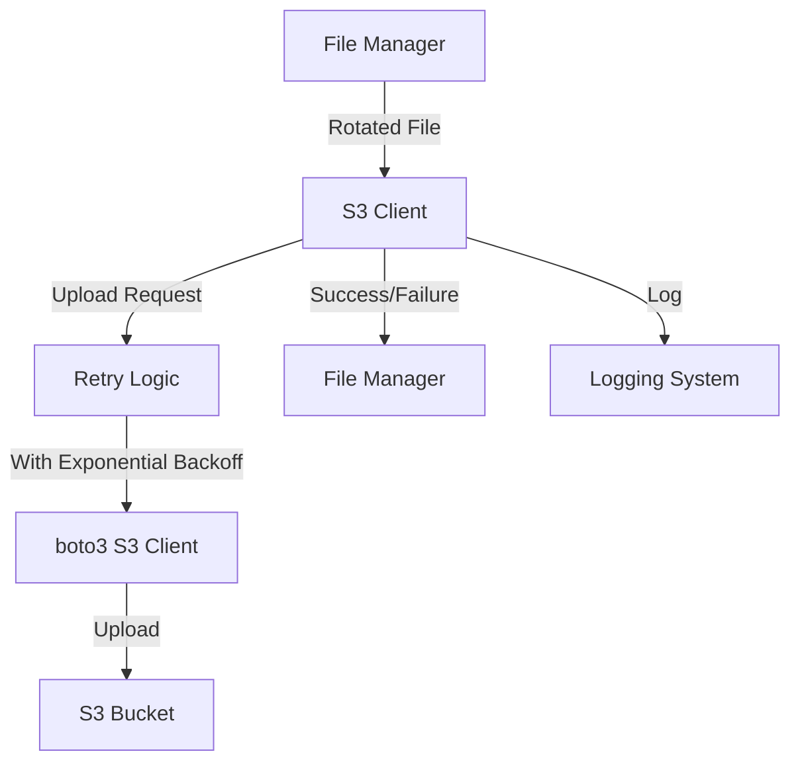

# S3 Upload Functionality Design

## Overview
The S3 upload component is responsible for securely and reliably transferring the rotated XML files to an S3 bucket. It handles authentication, error recovery, and ensures that files are properly named and organized for Snowflake ingestion.

## Architecture Diagram



## Component Design

### 1. S3 Client Configuration
- **Bucket Name**: Configurable via environment variable `BUCKET_NAME` (required)
- **Prefix**: Configurable via environment variable `PREFIX` (default: `xml-events/`)
- **AWS Credentials**: Sourced from environment variables:
  - `AWS_ACCESS_KEY_ID`
  - `AWS_SECRET_ACCESS_KEY`
  - `AWS_REGION`
- **Optional Date-based Folders**: Support for organizing files by date (e.g., `xml-events/2025/07/29/`)

### 2. Upload Process
- **File Naming**: Use UTC timestamps for consistent naming (e.g., `20250729_161500.xml`)
- **Content Type**: Set appropriate content type (`application/xml` or `application/json`)
- **Metadata**: Include metadata for tracking and debugging
- **Retry Logic**: Implement exponential backoff for transient failures

### 3. Error Handling
- **Connection Errors**: Retry with exponential backoff
- **Authentication Errors**: Log detailed error and fail fast (credentials issue)
- **Permission Errors**: Log detailed error and fail fast (IAM issue)
- **Throttling**: Handle AWS throttling with appropriate backoff
- **Partial Uploads**: Support for multipart upload resumption for large files

### 4. Code Structure

```python
# Pseudocode for S3 Upload Functionality

import os
import time
import logging
import boto3
from botocore.exceptions import ClientError
from typing import Dict, Any, Optional

class S3Client:
    def __init__(self, config: Dict[str, Any]):
        """Initialize S3 client with configuration."""
        self.bucket_name = config.get("BUCKET_NAME")
        if not self.bucket_name:
            raise ValueError("BUCKET_NAME environment variable is required")
        
        self.prefix = config.get("PREFIX", "xml-events/")
        self.use_date_folders = config.get("USE_DATE_FOLDERS", False)
        self.max_retries = int(config.get("MAX_RETRIES", 5))
        self.retry_base_delay = float(config.get("RETRY_BASE_DELAY", 1.0))
        
        # Initialize boto3 client
        try:
            self.s3 = boto3.client(
                's3',
                region_name=config.get("AWS_REGION"),
                # If credentials not in env vars, boto3 will check other sources
            )
            logging.info(f"S3 client initialized for bucket: {self.bucket_name}")
        except Exception as e:
            logging.error(f"Failed to initialize S3 client: {e}")
            raise
    
    def get_s3_key(self, filename: str) -> str:
        """Generate S3 key with optional date-based folders."""
        base_filename = os.path.basename(filename)
        
        if self.use_date_folders and len(base_filename) >= 8:
            # Extract date components from filename (assumes format: YYYYMMDD_HHMMSS.xml)
            try:
                year = base_filename[0:4]
                month = base_filename[4:6]
                day = base_filename[6:8]
                return f"{self.prefix}{year}/{month}/{day}/{base_filename}"
            except (IndexError, ValueError):
                logging.warning(f"Could not parse date from filename: {base_filename}")
                return f"{self.prefix}{base_filename}"
        else:
            return f"{self.prefix}{base_filename}"
    
    def upload_file(self, file_path: str, s3_key: Optional[str] = None) -> bool:
        """
        Upload a file to S3 with retry logic.
        
        Args:
            file_path: Path to the local file
            s3_key: Optional key override, otherwise generated from filename
            
        Returns:
            bool: True if upload was successful, False otherwise
        """
        if not os.path.exists(file_path):
            logging.error(f"File not found: {file_path}")
            return False
        
        if not s3_key:
            s3_key = self.get_s3_key(os.path.basename(file_path))
        
        # Determine content type based on file extension
        content_type = "application/xml"
        if file_path.endswith(".json"):
            content_type = "application/json"
        
        # Add metadata
        metadata = {
            "uploaded_at": time.strftime("%Y-%m-%dT%H:%M:%SZ", time.gmtime()),
            "source": "xml-stream-aggregator"
        }
        
        # Attempt upload with retries
        for attempt in range(1, self.max_retries + 1):
            try:
                logging.info(f"Uploading {file_path} to s3://{self.bucket_name}/{s3_key} (Attempt {attempt}/{self.max_retries})")
                
                self.s3.upload_file(
                    file_path,
                    self.bucket_name,
                    s3_key,
                    ExtraArgs={
                        'ContentType': content_type,
                        'Metadata': metadata
                    }
                )
                
                logging.info(f"Successfully uploaded {file_path} to s3://{self.bucket_name}/{s3_key}")
                return True
                
            except ClientError as e:
                error_code = e.response.get('Error', {}).get('Code', 'Unknown')
                
                # Handle different error types
                if error_code in ['AccessDenied', 'InvalidAccessKeyId', 'SignatureDoesNotMatch']:
                    # Authentication/permission errors - fail fast
                    logging.error(f"S3 authentication error: {error_code} - {str(e)}")
                    return False
                    
                elif error_code in ['SlowDown', 'RequestTimeTooSkewed', 'RequestTimeout']:
                    # Throttling/timing errors - retry with backoff
                    if attempt < self.max_retries:
                        delay = self.retry_base_delay * (2 ** (attempt - 1))  # Exponential backoff
                        logging.warning(f"S3 throttling error: {error_code}, retrying in {delay:.2f}s")
                        time.sleep(delay)
                    else:
                        logging.error(f"S3 throttling error: {error_code}, max retries exceeded")
                        return False
                        
                else:
                    # Other errors - retry with backoff for transient issues
                    if attempt < self.max_retries:
                        delay = self.retry_base_delay * (2 ** (attempt - 1))
                        logging.warning(f"S3 error: {error_code} - {str(e)}, retrying in {delay:.2f}s")
                        time.sleep(delay)
                    else:
                        logging.error(f"S3 error: {error_code} - {str(e)}, max retries exceeded")
                        return False
                        
            except Exception as e:
                # Unexpected errors
                if attempt < self.max_retries:
                    delay = self.retry_base_delay * (2 ** (attempt - 1))
                    logging.warning(f"Unexpected error during S3 upload: {str(e)}, retrying in {delay:.2f}s")
                    time.sleep(delay)
                else:
                    logging.error(f"Unexpected error during S3 upload: {str(e)}, max retries exceeded")
                    return False
        
        return False  # Should not reach here, but just in case
    
    def check_bucket_access(self) -> bool:
        """Test S3 bucket access to validate credentials and permissions."""
        try:
            self.s3.head_bucket(Bucket=self.bucket_name)
            logging.info(f"Successfully verified access to bucket: {self.bucket_name}")
            return True
        except ClientError as e:
            error_code = e.response.get('Error', {}).get('Code', 'Unknown')
            logging.error(f"Failed to access bucket {self.bucket_name}: {error_code} - {str(e)}")
            return False
        except Exception as e:
            logging.error(f"Unexpected error checking bucket access: {str(e)}")
            return False
```

### 5. Integration Points

- **File Manager**: Receives upload requests from the file rotation component
- **Configuration**: Reads settings from environment variables
- **Logging**: Comprehensive logging for monitoring and debugging
- **Error Reporting**: Provides clear success/failure feedback to calling components

### 6. Error Handling and Resilience

- **Credential Validation**: Early validation of AWS credentials
- **Bucket Access Check**: Verify bucket access on startup
- **Exponential Backoff**: Smart retry logic for transient failures
- **Error Classification**: Different handling for different error types
- **Detailed Logging**: Comprehensive error information for troubleshooting

## Considerations and Trade-offs

1. **Performance vs Reliability**: The design prioritizes reliability over maximum throughput
2. **Retry Strategy**: Exponential backoff balances quick recovery with avoiding API throttling
3. **File Organization**: Optional date-based folders improve organization but add complexity
4. **Error Handling**: Detailed error handling improves diagnostics but increases code complexity
5. **Credentials Management**: Using environment variables follows best practices but requires secure configuration