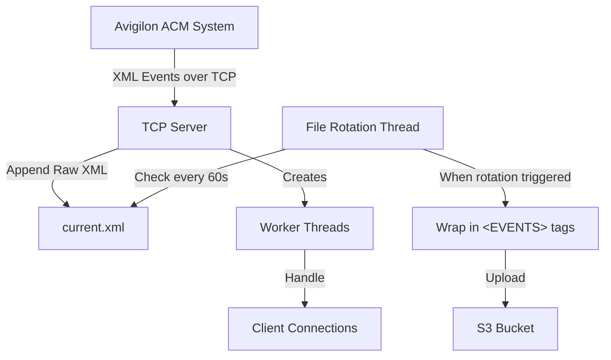

# TCP Server Component Design

## Overview
The TCP server will listen on a configurable port (default: 8080) for incoming XML event streams from the Avigilon ACM system. It will receive the raw XML data and append it to a local file (`current.xml`), which will later be processed by the file rotation and S3 upload components.

## Architecture Diagram



## Component Design

### 1. Server Configuration
- **Port**: Configurable via environment variable `PORT` (default: 8080)
- **Host**: Listen on all interfaces (0.0.0.0)
- **Socket Options**: 
  - `SO_REUSEADDR` to allow quick restart after shutdown
  - Non-blocking mode for concurrent connection handling

### 2. Connection Handling
- **Threading Model**: Use a thread pool to handle multiple concurrent connections
- **Main Thread**: Accept new connections and dispatch to worker threads
- **Worker Threads**: Receive data from clients and append to the current file
- **Thread Safety**: Use locks when writing to the shared file

### 3. Data Processing
- **Buffering**: Use appropriate buffer sizes for receiving XML data (e.g., 4096 bytes)
- **Append Strategy**: Append raw XML data directly to `current.xml` without parsing
- **Error Handling**: 
  - Handle connection drops gracefully
  - Reconnect logic for persistent connections
  - Log errors without crashing the server

### 4. Code Structure

```python
# Pseudocode for TCP Server Component

import socket
import threading
import os
import logging
from typing import Dict, Any

class TCPServer:
    def __init__(self, config: Dict[str, Any]):
        """Initialize TCP server with configuration."""
        self.host = "0.0.0.0"
        self.port = int(config.get("PORT", 8080))
        self.current_file = config.get("CURRENT_FILE", "./current.xml")
        self.file_lock = threading.Lock()
        self.running = False
        self.server_socket = None
        self.worker_threads = []
        
    def start(self):
        """Start the TCP server."""
        self.server_socket = socket.socket(socket.AF_INET, socket.SOCK_STREAM)
        self.server_socket.setsockopt(socket.SOL_SOCKET, socket.SO_REUSEADDR, 1)
        self.server_socket.bind((self.host, self.port))
        self.server_socket.listen(5)
        self.running = True
        
        logging.info(f"Server started on {self.host}:{self.port}")
        
        try:
            while self.running:
                try:
                    client_socket, address = self.server_socket.accept()
                    logging.info(f"Connection from {address}")
                    client_thread = threading.Thread(
                        target=self.handle_client,
                        args=(client_socket, address)
                    )
                    client_thread.daemon = True
                    client_thread.start()
                    self.worker_threads.append(client_thread)
                except socket.error as e:
                    logging.error(f"Socket error: {e}")
                    continue
        finally:
            self.stop()
    
    def handle_client(self, client_socket, address):
        """Handle client connection in a worker thread."""
        try:
            buffer = b""
            while self.running:
                data = client_socket.recv(4096)
                if not data:
                    break  # Client disconnected
                
                # Append data to current file
                with self.file_lock:
                    with open(self.current_file, "ab") as f:
                        f.write(data)
                
                logging.debug(f"Received {len(data)} bytes from {address}")
        except Exception as e:
            logging.error(f"Error handling client {address}: {e}")
        finally:
            client_socket.close()
            logging.info(f"Connection closed: {address}")
    
    def stop(self):
        """Stop the TCP server."""
        self.running = False
        if self.server_socket:
            self.server_socket.close()
        logging.info("Server stopped")
```

### 5. Integration Points

- **File Rotation**: The TCP server will share access to `current.xml` with the file rotation component
- **Configuration**: Server will read configuration from environment variables
- **Logging**: Comprehensive logging for monitoring and debugging
- **Shutdown Handling**: Graceful shutdown on SIGTERM/SIGINT

### 6. Error Handling and Resilience

- **Connection Drops**: Detect and log disconnections
- **Malformed Data**: Continue operation even if received data is malformed
- **Resource Exhaustion**: Limit number of concurrent connections to prevent overload
- **File I/O Errors**: Retry logic for file operations with exponential backoff

## Considerations and Trade-offs

1. **Performance vs Simplicity**: The design prioritizes reliability and simplicity over maximum throughput
2. **Thread Safety**: Using locks for file access may introduce some overhead but ensures data integrity
3. **Error Recovery**: The server will continue running even if individual connections fail
4. **Scalability**: The thread-per-connection model works well for moderate loads but may need adjustment for very high connection counts